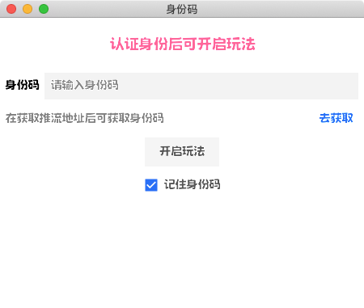
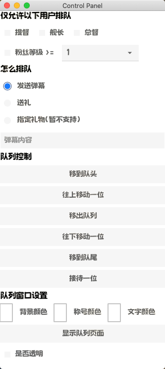
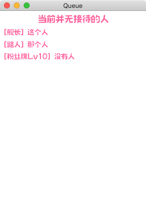

### Bilibili 弹幕排队

基于 [fyne](https://github.com/fyne-io/fyne) 做的跨平台客户端，因为感兴趣，所以简单做了一个玩玩。

#### 主要功能
* 连接 b 站弹幕服务器，使用新的 v2/api
* 弹幕排队
* 支持弹幕队列控制以及自定义部分颜色
* 支持透明背景，方便直播设备采集窗口

#### 使用需求

* 参考 fyne 官方文档配置好本地环境

#### 使用方式

需要配置两个地方，一个是 `bili/define.go` 文件中
```
const(
    //bilibili 开发者 ak
    AccessKey = "XXXXXXXXXXXX"
    //bilibili 开发者 as
    AccessSecret = "xxxxxxxxxxxxxxxxxxxxxx"
)
```

另一个是 `bili.go` 中的
```
const(
	//bilibili 饭贩上创建项目的ID
	AppID = 1888888888888
)
```
这两个配置好，弹幕服务器就能正常连接了。
如果只是查看页面，那么可以在 `ui.go` 里面将 test code 注释打开，然后上面的 window 创建代码都注释掉。
```
func uiInit()  {
	a := app.NewWithID("com.queue.demo")
	a.Settings().SetTheme(&OpaqueTheme{})
	fmt.Println(fyne.CurrentApp().Storage().RootURI())

	queueWindow := queueWindow()
	mainWindow := fyneWindow(queueWindow,nil)
	codeWindow := codeInputWindow(mainWindow)

	(*codeWindow).ShowAndRun()

	//test code
	//mainWindow := fyneWindow(nil,nil)
	//codeWindow := codeInputWindow(mainWindow)
	//(*mainWindow).ShowAndRun()
}
```

#### 预览图

登录页面：



控制面板页面：



队列页面：



#### 成品链接
这个项目已经在 b 站的饭贩上架了，可以在 [传送门](https://play-live.bilibili.com/details/1683719959529?from=1) 体验。

#### 其他吐槽
* b 站的文档是真的烂，弹幕连接业务代码是从 b 站开发者文档的 demo 里面摘取下来修改的，b 站没有 v2 接口的 go 实现代码。b 站 demo 还运行不了，后面询问后才知道已经之前的接口都废弃了。
* fyne 这个库有很多很多不足的地方，使用的时候会有很多很多坑。
* 这里没有 linux 打包的脚本，主要是因为我没有在使用带桌面的 linux 系统。